# MyExplorer — High-Performance Disk Analyzer (C++17)

---
## TL;DR

MyExplorer is a high-performance filesystem analyzer written in C++17 designed to scan and process large directories (10M+ files target).

It uses:
- A custom memory pool (VirtualAlloc-based) to reduce allocation overhead
- A string interning system (Flyweight) to minimize memory usage
- A multithreaded scan engine (thread pool) for parallel filesystem traversal
- A compact LCRS tree structure for efficient hierarchy representation

The system is optimized for I/O-bound workloads and demonstrates scalable performance up to SSD throughput limits, with up to ~3.5x speedup on multi-core systems in benchmarks.

The project focuses on real-world systems constraints rather than synthetic benchmarks.

Skills covered: C++17, multithreading, memory management, systems programming, performance optimization, Windows internals (VirtualAlloc)

## Why this matters

Filesystem tools are often slow, memory-heavy, and not designed for large-scale traversal workloads.

MyExplorer explores how far a C++ system can be pushed using:
- custom memory management
- cache-friendly data structures
- parallel execution strategies
- and realistic I/O-bound performance constraints

This project demonstrates practical systems programming skills applicable to:
- backend infrastructure tools
- performance-critical applications
- system utilities
- engine development

---
## 🚀 Overview

The system follows a modular architecture separating:
- parallel filesystem traversal
- memory management and pooling
- hierarchical data construction
- query and aggregation logic

The goal is to evaluate how far a custom C++ engine can be pushed in terms of throughput, memory efficiency, and concurrency under SSD-bound workloads.

This project was built as a performance exploration tool rather than a production filesystem implementation.

---

## 🏗 System Architecture

The engine is structured into distinct layers: filesystem traversal, task scheduling, memory management, and data aggregation. The core engine is decoupled from any presentation layer, enabling multiple frontends (CLI, future GUI, or API exposure) without modifications to core logic.

```mermaid


graph TD
    %% Entry & Frontend
    CLI[CLI Interface & Monitoring] -->|Dispatches Scan| TP{ThreadPool <br/> N Workers}
    
    %% Execution Layer
    subgraph ExecutionEngine ["Parallel Scan Engine"]
        TP -->|Concurrent Tasks| FS[std::filesystem Traversal]
        FS -.->|Real-time Telemetry| AC((Atomic Counter))
        AC -.->|Live UI Spinners| CLI
    end

    %% Storage Layer
    subgraph MemorySystem ["Minimized heap contention via pooled allocation"]
        FS -->|1. Path Interning| SP[(StringPool <br/> Flyweight Pattern)]
        FS -->|2. Lock-Free Allocate| MP[(MemoryPool <br/> VirtualAlloc Arena)]
    end

    %% Data Layout & Navigation
    subgraph DataLayer ["Data Layout & Query Engine"]
        MP -->|Backs| LCRS[Compact LCRS Tree <br/> 32-byte FileNodes]
        LCRS -->|Recursive Aggregation| QE[Query & Sorting Engine]
    end

    QE -->|Formatted Presentation| CLI

    %% Design Styles
    style TP fill:#1e293b,stroke:#3b82f6,stroke-width:2px
    style MP fill:#1e1b4b,stroke:#6366f1,stroke-width:2px
    style SP fill:#1e1b4b,stroke:#6366f1,stroke-width:2px
    style LCRS fill:#311042,stroke:#a855f7,stroke-width:2px
    style QE fill:#14532d,stroke:#22c55e,stroke-width:2px
```

---

## ⚙️ Core Design Decisions

The codebase is built with strict adherence to modern C++ best practices and established architectural principles:

*   **Design Patterns Applied:**
    *   **Object Pool / Custom Allocators:** Preallocated `MemoryPool` and `StringPool` drastically reduce heap allocations and OS-level lock contention during multithreaded execution.
    *   **Flyweight:** String interning prevents duplicate path/extension strings, keeping memory footprint to a strict minimum.
    *   **Hierarchical Tree Representation:** Implemented using a Left-Child Right-Sibling (LCRS) structure to efficiently represent large filesystem hierarchies while minimizing pointer overhead.
*   **Data-Oriented Design (DOD):** Favoring compact memory layouts, pooled allocations, and offset-based references to reduce cache misses and heap fragmentation.
---

## 📊 Performance Targets & Threading Strategy

*   **O(N)** filesystem traversal using `std::filesystem`.
*   **O(N log N)** optimized sorting for query aggregation.
*   **Memory Target:** 32 bytes per node.
*   **Cache Locality:** Designed around compact memory layouts and offset-based references to eliminate the overhead of traditional pointer-heavy tree structures.

### The I/O Bound Reality
The current implementation uses a thread pool mapped to the number of physical CPU cores. However, extensive benchmarking revealed the workload is **primarily I/O-bound**.

*   Performance scales nearly linearly up to ~4 threads.
*   Beyond 4 threads, gains diminish sharply due to disk read-queue saturation and OS-level I/O contention.
*   *Conclusion:* Additional threads primarily improve latency hiding, but do not linearly scale throughput. Production deployment allows user-configurable thread counts to match their specific SSD NVMe hardware limits.

---

## ⏱️ Performance Profiling & Benchmarks

### Environment Notes
* **Operating System:** Windows 11 (NTFS File System)
* **Storage:** Solid State Drive (SSD)
* **Execution:** Ran with Administrator privileges to bypass OS permission overhead and caching bias.

---

### 📊 Benchmark : `C:\Windows` (Directory Scan on an average of 10 runs)
* **Total Dataset Size:** 348,216 Files & Folders
* **Memory Arena Footprint (Virtual Space Reserved):** 305.18 MB

| Metric | 1 Thread (Baseline) | 2 Threads | 4 Threads | 12 Threads (Max Hardware) |
| :--- | :---: | :---: | :---: | :---: |
| **Scan Time** | 19.66 s | 12.44 s | 7.61 s | **5.67 s** |
| **Speedup Factor** | 1.00x | 1.58x | 2.58x | **3.47x** |
| **Nodes / sec** | 17,712 n/s | 27,999 n/s | 45,729 n/s | **61,445 n/s** |
| **Peak Memory (RAM)**| 31.34 MB | 34.12 MB | 35.91 MB | **37.39 MB** |
| **Committed RAM** | 29.30 MB | 29.80 MB | 30.83 MB | **33.03 MB** |
| **Allocation Throughput**| 0.54 MB/s | 0.85 MB/s | 1.40 MB/s | **1.88 MB/s** |
| **I/O Scaling Efficiency**| 100.00% | 79.04% | 64.55% | **28.91%** |

---

### 🧠 Performance & Architecture Insights

#### 1. High-Performance Memory Arena (`VirtualAlloc`)
The core optimization of the `MemoryPool` using the Windows native API (`VirtualAlloc` paired with a dynamic 4MB `MEM_COMMIT` paging strategy) yields exceptional results. During a massive scan of `C:\Windows`, the physical memory footprint (**Committed Memory**) is strictly contained to just **33.03 MB**, down from over 370 MB using initial standard containers. The engine minimizes reallocations by using a reserved virtual memory arena (305.18 MB) and a custom allocation strategy, reducing fragmentation and avoiding vector reallocations.

#### 2. Multi-Threading Scaling & I/O Saturation
The **I/O Scaling Efficiency** tracking uncovers the exact behavior of the engine against the hardware limitations:
* Scaling from 1 to 4 cores delivers a clean, predictable speedup (dropping execution time from 19.66s down to 7.61s).
* At maximum configuration (12 hardware threads), the overall scan time drops to **5.67s**, sustaining an injection throughput of **61,445 nodes per second** into the logical tree.
* At 12 threads, scaling efficiency stabilizes at 28.91%, suggesting a transition from CPU-bound execution toward I/O-bound saturation. This suggests that the bottleneck is no longer CPU-bound or allocator-bound (thanks to lock-free atomics), but instead constrained by the host SSD’s random read I/O throughput over NTFS. The results indicate that the engine is likely approaching SSD I/O saturation under test conditions.
  
---

## 🛠️ Current Status & Roadmap

The project is currently in an **iterative optimization phase**. The current version successfully validates the memory layout strategy, multithreaded Command/Worker model, and large-scale traversal stability.

**Upcoming Iterations:**
1.  **Adaptive Concurrency:** Dynamically scaling active workers based on real-time I/O back-pressure.
2.  **Streaming Aggregation:** Real-time data bubbling to support progressive UI rendering.
3.  **GUI Integration:** Connecting the current API to a modern visual presentation layer.

---

## ⚠️ Limitations

This project is optimized for read-heavy filesystem traversal workloads and does not aim to be a general-purpose filesystem engine.

Key limitations include:
- Performance is heavily dependent on underlying SSD I/O characteristics
- Write operations and mutation-heavy workloads are not optimized
- Thread scaling is constrained by OS-level I/O scheduling rather than CPU availability
- Memory pool strategy trades flexibility for performance, limiting dynamic allocation patterns
- Benchmark results may vary depending on filesystem state and cache conditions

These limitations reflect intentional design trade-offs for performance and are not considered implementation constraints.

---

## 🤖 Note on Tooling

All architectural and performance decisions were designed and validated manually.
AI tooling (local Gemma 4 / E4B via Cline) was used strictly for reviewing and documentation assistance.
