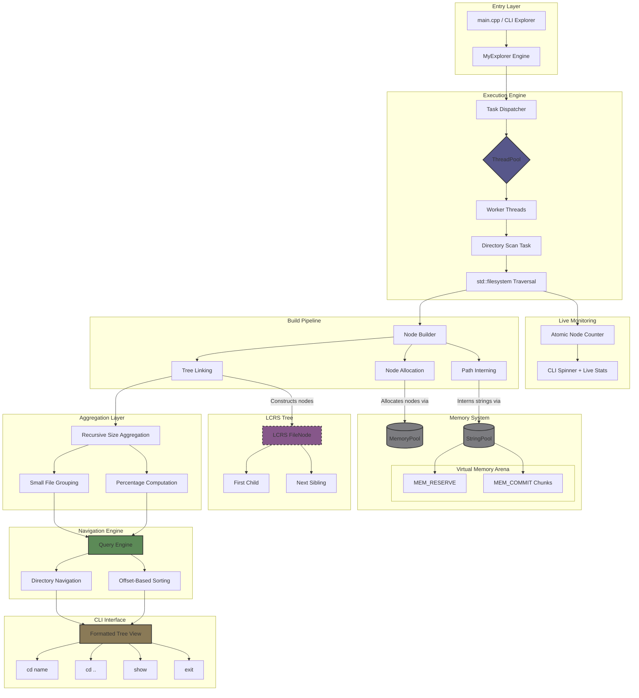

# MyExplorer — High-Performance Disk Analyzer (C++17)

## 🚀 Overview

MyExplorer is a systems-level performance exploration project. It is designed to handle massive filesystems (10M+ files) by prioritizing **Memory Locality**, **Cache efficiency**, and **Parallel I/O execution**. 

*This project focuses on systems-level performance engineering and large-scale filesystem traversal under real-world I/O constraints.*

---

## 🏗 System Architecture

The engine is structured into distinct layers: filesystem traversal, task scheduling, memory management, and data aggregation. The core engine is decoupled from any presentation layer, enabling multiple frontends (CLI, future GUI, or API exposure) without modifications to core logic.

---

## ⚙️ Core Design Decisions

The codebase is built with strict adherence to modern C++ best practices and established architectural principles:

*   **Design Patterns Applied:**
    *   **Object Pool / Custom Allocators:** Preallocated `MemoryPool` and `StringPool` drastically reduce heap allocations and OS-level lock contention during multithreaded execution.
    *   **Flyweight:** String interning prevents duplicate path/extension strings, keeping memory footprint to a strict minimum.
    *   **Hierarchical Tree Representation:** Implemented using a Left-Child Right-Sibling (LCRS) structure to efficiently represent large filesystem hierarchies while minimizing pointer overhead.
*   **Data-Oriented Design (DOD):** Favoring compact memory layouts, pooled allocations, and offset-based references to reduce cache misses and heap fragmentation.
---

## 📊 Performance Targets & Threading Strategy

*   **O(N)** filesystem traversal using `std::filesystem`.
*   **O(N log N)** optimized sorting for query aggregation.
*   **Memory Target:** ~100 bytes per node (Scalable to 10M+ files).
*   **Improving cache locality and reducing memory overhead compared to traditional pointer-heavy tree structures.

### The I/O Bound Reality
The current implementation uses a thread pool mapped to the number of physical CPU cores. However, extensive benchmarking revealed the workload is **primarily I/O-bound**.

*   Performance scales nearly linearly up to ~4 threads.
*   Beyond 4 threads, gains diminish sharply due to disk read-queue saturation and OS-level I/O contention.
*   *Conclusion:* Additional threads primarily improve latency hiding, but do not linearly scale throughput. Production deployment allows user-configurable thread counts to match their specific SSD NVMe hardware limits.

---

## ⏱️ Benchmarks

**Environment Notes:**
*   Windows filesystem (NTFS)
*   Solid State Drive (SSD)
*   Executed with administrator privileges (to bypass permission-check overhead and OS bias)

### Benchmark 1: `C:/Windows`
| Threads | Nodes   | Time (s) | Speedup |
| ------- | ------- | -------- | ------- |
| 1       | 347,827 | 19.50    | 1.0x    |
| 2       | 347,827 | 12.64    | 1.54x   |
| 4       | 347,827 | 7.81     | 2.50x   |
| 12      | 347,827 | 5.73     | 3.40x   |

### Benchmark 2: `C:/` (Full Drive)
| Threads | Nodes     | Time (s) | Speedup |
| ------- | --------- | -------- | ------- |
| 1       | 1,143,006 | 60.48    | 1.0x    |
| 2       | 1,143,007 | 38.36    | 1.58x   |
| 4       | 1,143,008 | 22.74    | 2.66x   |
| 12      | 1,143,008 | 14.95    | 4.04x   |

---

## 🛠️ Current Status & Roadmap

The project is currently in an **iterative optimization phase**. The current version successfully validates the memory layout strategy, multithreaded Command/Worker model, and large-scale traversal stability.

**Upcoming Iterations:**
1.  **Adaptive Concurrency:** Dynamically scaling active workers based on real-time I/O back-pressure.
2.  **Streaming Aggregation:** Real-time data bubbling to support progressive UI rendering.
3.  **GUI Integration:** Connecting the current API to a modern visual presentation layer.

---

## 🤖 Note on Tooling

All architectural and performance decisions were designed and validated manually.
AI tooling (local Gemma 4 / E4B via Cline) was used strictly for code organization and documentation assistance.
