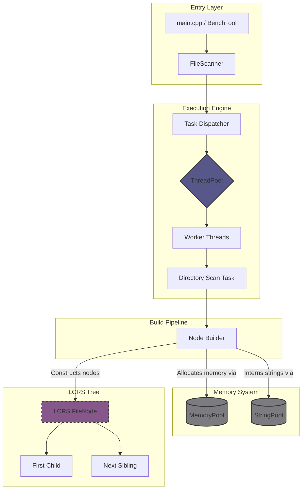

# MyExplorer — High-Performance Disk Analyzer (C++17)

## 🚀 Professional Engineering Showcase

MyExplorer is a systems-level performance exploration project. It is designed to handle massive filesystems (10M+ files) by prioritizing **Memory Locality**, **Cache-Friendliness**, and **Parallel Execution**. 

*This project demonstrates advanced software engineering, specifically focusing on how code behaves under extreme scale and I/O constraints, moving beyond "just working" to strictly optimized execution.*

---

## 🏗 System Architecture

The engine follows a **Layered Architecture** and **Data-Oriented Design (DOD)** to eliminate heap fragmentation and maximize CPU cache hits. The core engine is strictly decoupled from the presentation layer (currently CLI, allowing seamless future GUI integration without modifying core logic).

---

## ⚙️ Engineering Principles & Design Patterns

The codebase is built with strict adherence to modern C++ best practices and established architectural principles:

*   **SOLID (SRP & OCP):** High modularity. The `FileScanner` strictly handles OS-level traversal, the `NodeBuilder` assembles the data, and custom allocators manage memory. The engine is open to new interfaces (CLI/GUI) without requiring core logic modifications.
*   **Design Patterns Applied:**
    *   **Object Pool / Custom Allocators:** Preallocated `MemoryPool` and `StringPool` drastically reduce heap allocations and OS-level lock contention during multithreaded execution.
    *   **Flyweight:** String interning prevents duplicate path/extension strings, keeping memory footprint to a strict minimum (~100 bytes/node).
    *   **Composite Pattern:** Implemented via a Left-Child Right-Sibling (LCRS) tree, allowing O(1) contiguous memory traversal instead of standard pointer-heavy trees.
*   **Data-Oriented Design (DOD):** Favoring contiguous arrays and offsets over pointers to drastically reduce L1/L2 cache misses.
*   **KISS & YAGNI:** The thread pool dynamically sizes to physical cores, but complex dynamic back-pressure was intentionally deferred to prioritize measuring raw I/O saturation first.

---

## 📊 Performance Targets & Threading Strategy

*   **O(N)** filesystem traversal using `std::filesystem`.
*   **O(N log N)** optimized sorting for query aggregation.
*   **Memory Target:** ~100 bytes per node (Scalable to 10M+ files).

### The I/O Bound Reality
The current implementation uses a thread pool mapped to the number of physical CPU cores. However, extensive benchmarking revealed the workload is **primarily I/O-bound**.

*   Performance scales nearly linearly up to ~4 threads.
*   Beyond 4 threads, gains diminish sharply due to disk read-queue saturation and OS-level I/O contention.
*   *Conclusion:* Additional threads primarily improve latency hiding, but do not linearly scale throughput. Production deployment allows user-configurable thread counts to match their specific SSD NVMe hardware limits.

---

## ⏱️ Benchmarks

**Environment Notes:**
*   Windows filesystem (NTFS)
*   Solid State Drive (SSD)
*   Executed with administrator privileges (to bypass permission-check overhead and OS bias)

### Benchmark 1: `C:/Windows`
| Threads | Nodes   | Time (s) | Speedup |
| ------- | ------- | -------- | ------- |
| 1       | 347,827 | 19.50    | 1.0x    |
| 2       | 347,827 | 12.64    | 1.54x   |
| 4       | 347,827 | 7.81     | 2.50x   |
| 12      | 347,827 | 5.73     | 3.40x   |

### Benchmark 2: `C:/` (Full Drive)
| Threads | Nodes     | Time (s) | Speedup |
| ------- | --------- | -------- | ------- |
| 1       | 1,143,006 | 60.48    | 1.0x    |
| 2       | 1,143,007 | 38.36    | 1.58x   |
| 4       | 1,143,008 | 22.74    | 2.66x   |
| 12      | 1,143,008 | 14.95    | 4.04x   |

---

## 🛠️ Current Status & Roadmap

The project is currently in an **iterative optimization phase**. The current version successfully validates the memory layout strategy, multithreaded Command/Worker model, and large-scale traversal stability.

**Upcoming Iterations:**
1.  **Adaptive Concurrency:** Dynamically scaling active workers based on real-time I/O back-pressure.
2.  **Streaming Aggregation:** Real-time data bubbling to support progressive UI rendering.
3.  **GUI Integration:** Connecting the current API to a modern visual presentation layer.

---

## 🤖 Note on Tooling

All architectural decisions, performance constraints, and benchmarking design were engineered and validated manually. AI tooling (local Gemma 4 / E4B via Cline) was utilized strictly as a productivity multiplier for boilerplate generation and documentation formatting, not as a replacement for system engineering decisions.
